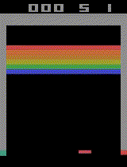
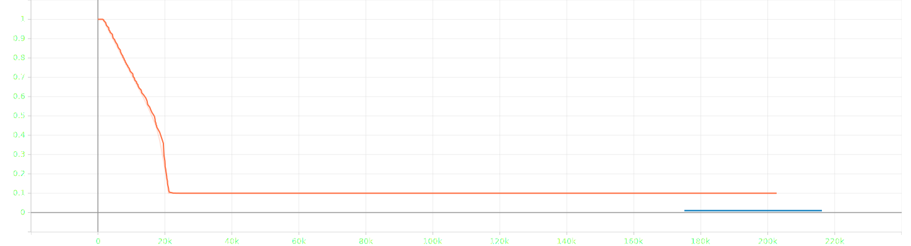
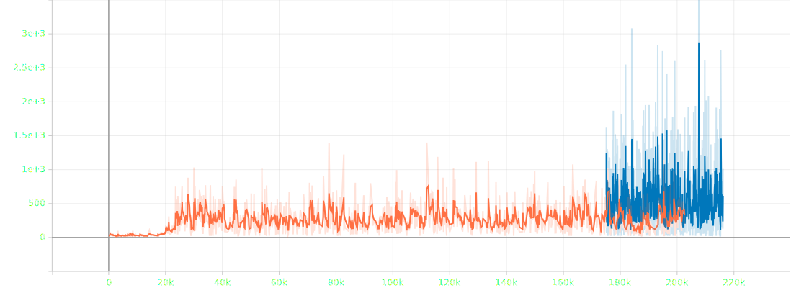
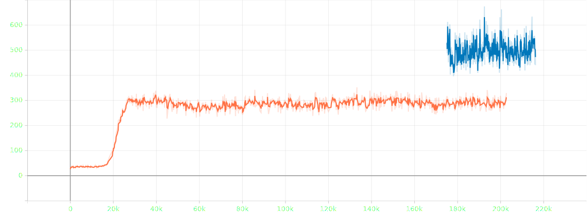
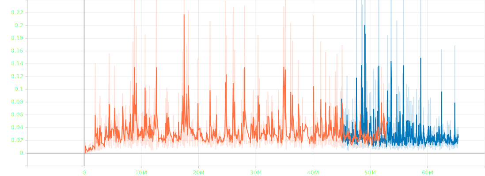
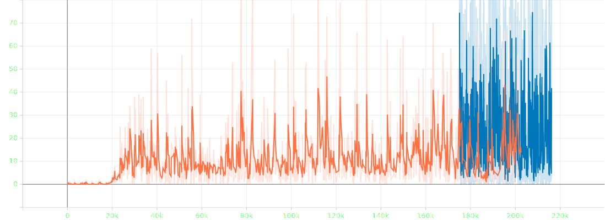
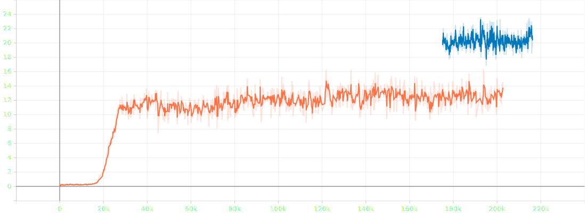

# <div align="center"> -- Reinforcement Learning Project -- <br/> Article : Human-level control through deep reinforcement learning</div>

## Introduction

This repository contains the code for the article "Human-level control through deep reinforcement learning" by Volodymyr Mnih et al. (2015). The code is based on the [original paper](content/article.pdf).
The goal of this project is to reproduce the implementation detailed in the article and to train the model on the Atari game Breakout.

## Installation

The code is written in Python 3.13.12 and uses PyTorch 2.1.0 with CUDA 13.0. The dependencies are listed in the `pyproject.toml` file.

First, create a virtual environment with poetry and install the dependencies with the following command:

```bash
poetry install
poetry env activate
```

If you encounter any issues with the PyTorch installation, you can force-reinstall it using pip:

```bash
pip install --upgrade --force-reinstall torch torchvision torchaudio --index-url https://download.pytorch.org/whl/cu121
```

> **Note**: You can change the CUDA version in the URL. For more information, please refer to the [PyTorch website](https://pytorch.org/get-started/locally/).


## Usage

To train the model on the Atari game Breakout, run the following command:

```bash
python main.py train Breakout-v4 --name model_name
```

Once trained, the model is saved in the folder `models/Breakout-v4` as `{NAME}_{SUFFIX}.pt`. `NAME` corresponds to the argument provided and `SUFFIX` represents the number of training hours, `best` or `last`.

To play the game using the trained model, run:

```bash
python main.py play Breakout-v4 --name model_name
```

By default, the script loads the most recently trained model (`last`), but you can specify a particular suffix if needed.

For more information on arguments, run:

```bash
python main.py --help
```

Output:

```bash
usage: main.py [-h] [--mode MODE] [--difficulty DIFFICULTY] [--repeat REPEAT] [--name NAME] [--record] {train,retrain,play} game_name

Game Launcher

positional arguments:
  {train,retrain,play}  Specify 'train', 'retrain' or 'play'
  game_name             Name of the game

options:
  -h, --help            show this help message and exit
  --mode MODE           Game mode
  --difficulty DIFFICULTY
                        Difficulty level
  --repeat REPEAT       Number of hours to train or retrain the model
  --name NAME           Name of the model
  --record              Record the game
```

**Warning**: Do not end your model with `_{NUMBER}`, `_best` or `_last`. These suffixes are reserved for the saving process.

## Implementation Details & Deviations

While the core algorithm faithfully follows the pseudo-code provided in the original paper, a few technical modifications were made to improve stability and accommodate hardware constraints.

### 1. Algorithm Tweaks

* **Epsilon Decay**: The original paper uses a single linear decay from 1.0 to 0.1 over 1 million frames. In this implementation, the decay occurs in two phases: a linear decay from 1.0 to 0.1 over 1 million frames, followed by a second linear decay from 0.1 to 0.01 over the next 10 million frames. This encourages deeper exploitation later in the training.

* **Loss Function**: The error clipping described in the paper (dealing with squared errors clamped between -1 and 1) can be ambiguous to implement. To cleanly handle outliers and gradients, this code replaces it with the Huber Loss (with a delta of 1).

* **Optimizer**: Adam instead of RMSProp.

### 2. Time-Based Training Schedule
Instead of relying on a hard limit of steps or episodes, the training loop is governed by wall-clock time (hours). This choice was made for practical reasons, allowing for better personal resource management and predictable computer availability. The training process automatically halts once the specified duration is reached.

### 3. State Checkpointing

The training state is saved every hour. To allow for seamless retraining or pausing, each checkpoint includes:
* Online and target model weights
* Optimizer states
* Current number of steps, episodes, and hours elapsed
* Other hyperparameters required to resume training

Checkpoints are stored in `models/game_name/{NAME}_{SUFFIX}.pt`. The `last` suffix is simply a convenient pointer to the last checkpoint saved.

## Results

The model showcased below was trained on the game Breakout for a total of **50 hours**, encompassing **192,405 episodes** and **53,478,161 steps**. It was constructed by taking the first **42 hours** of the initial training run and continuing with **8 hours** of the second phase\
This specific checkpoint was selected as the **"best"** model from my implementaion: it achieved the highest moving average reward over the last 100 episodes.

> **Note:** The gameplay footage presented below highlights one of the model's most successful runs (cherry-picked).



### Training Metrics

The graphs below illustrate the training progression. The dual-color plotting represents two distinct training phases:

* **Orange line:** The initial training run spanning 50 hours.
* **Blue line:** A **20-hour** retraining phase that branched off from the 42-hour mark of the first model. During this phase, the minimum epsilon was manually reduced to **0.01** to encourage finer exploitation.

**Epsilon at the end of the episode**\
x-axis: episodes, y-axis: epsilon


**Lengths of the episode**\
x-axis: episodes, y-axis: length of the episode


**Lengths of the last 100 episodes**\
x-axis: 100 last episodes, y-axis: length of the episode


**Loss**\
x-axis: steps, y-axis: loss


**Rewards of the episode**\
x-axis: episodes, y-axis: reward of the episode


**Rewards of the last 100 episodes**\
x-axis: 100 last episodes, y-axis: reward of the episode


### Testing the Demo Model

If you want to test the pre-trained model shown in the demonstration above, follow these steps:

1. **Move the model file**: Copy the `demo.pt` file from the `content/` folder to the `models/Breakout-v4/` directory.
2. **Run the play command**: Use the following command to see the model in action:

```bash
python main.py play Breakout-v4 --name demo
```
