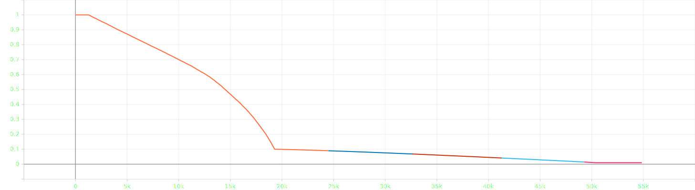
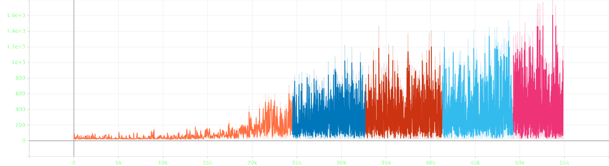
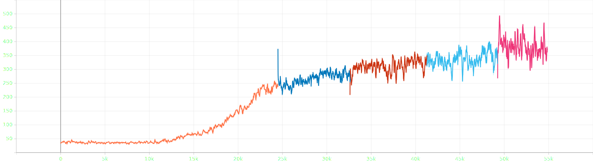
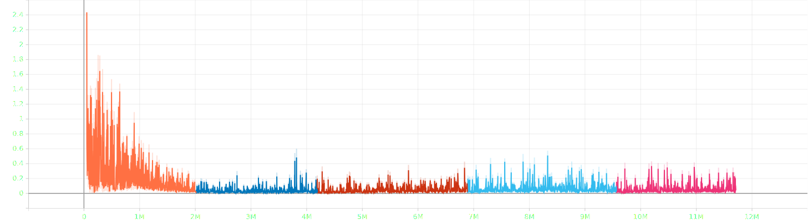
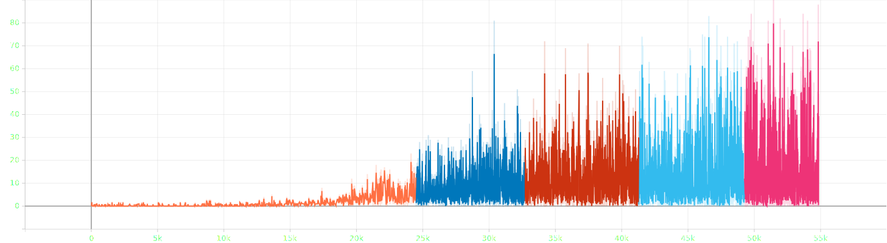

# <div align="center"> -- Reinforcement Learning Project -- <br/> Article : Human-level control through deep reinforcement learning</div>

## Introduction

This repository contains the code for the article "Human-level control through deep reinforcement learning" by Volodymyr Mnih et al. (2015). The code is based on the [original implementation](content/article.pdf)
The goal of this project is to reproduce the implementation of the article and to train the model on the Atari game Breakout.

## Installation

The code is written in Python 3.11.5 and uses PyTorch 2.1.0 avec CUDA 12.1. The dependencies are listed in the file `pyproject.toml`.

In first, create a virtual environment and with poetry, install the dependencies with the following command:

```bash
poetry install
poetry shell
```

If you have a problem with the installation of PyTorch, you can install it with the following command:

```bash
pip install --upgrade --force-reinstall torch torchvision torchaudio --index-url https://download.pytorch.org/whl/cu121
```

You can change the CUDA version in the URL.\
For more information, please refer to the [PyTorch website](https://pytorch.org/get-started/locally/).


## Usage

To train the model on the Atari game Breakout, run the following command:

```bash
python main.py play Breakout-v4 --name model_name
```

When the model is trained, the model is saved in the folder `models/game_name` with the name `{NAME}_{SUFFIX}.pth` where `NAME` is the name given in the arguments and `SUFFIX` is the number of hours of training or best or last.

To play with the model, run the following command:

```bash
python main.py play Breakout-v4 --name model_name
```

By default, the model choosen is the last model trained, but you can specify the suffix of the model if wanted.

For more information on the arguments, run the following command:

```bash
python main.py --help
```

Output:

```bash
usage: main.py [-h] [--mode MODE] [--difficulty DIFFICULTY] [--repeat REPEAT] [--name NAME] [--record] {train,retrain,play} game_name

Game Launcher

positional arguments:
  {train,retrain,play}  Specify 'train', 'retrain' or 'play'
  game_name             Name of the game

options:
  -h, --help            show this help message and exit
  --mode MODE           Game mode
  --difficulty DIFFICULTY
                        Difficulty level
  --repeat REPEAT       Number of hours to train or retrain the model
  --name NAME           Name of the model
  --record              Record the game
```

**Warning**: The name of the model must not end with `_{NUMBER}`, `_best` or `_last` as these names are reserved for the saving process.

## Explanation of the implementation

The pseudo-code of the algorithm is given in the article, but some details are implemented differently in the code. The main difference is the epsilon decay. In the article, the epsilon decay in one linear decay from 1 to 0.1 in 1 million frames. In the code, the epsilon decay is linear from 1 to 0.1 in 1 million frames, then another linear decay from 0.1 to 0.01 in 10 million frames. Another minor difference is the loss function, the optimized loss function in the article is difficult to understand, it deals with squarred error between -1 and 1, which is not possible, instead the loss function is the Huber loss with a delta of 1.

The training process about the number of steps, episodes or hours is not implemented. In my case, I trained the model with hours because it is easier to estimate the time of training and I needed my computer for other tasks. The training process is stopped when the model is trained for the number of hours specified in the arguments.

The model is saved every hour, it contains the weights of the model and the target model, the optimizer state, the number of steps, episodes and hours of training. Others parameters are save for retraining.<br>
It is saved in the folder `models/game_name` with the name `{NAME}_{SUFFIX}.pth` where `NAME` is the name given in the arguments and `SUFFIX` is the number of hours of training or best or last. Last is the same as the last number of hours of training.<br>

## Results

The model presented below is trained on the game Breakout for 50 hours, 54853 episodes and 11709224 steps.

In this level, the agent didn't finish the game but has a real score of 420 points and a clipped score of 105 points, in 2945 steps.


Here are the graphs of the training process, there is 5 colors because the model was trained 5 times.

**Epsilon at the end of the episode**<br>
x-axis: episodes, y-axis: epsilon


**Lengths of the episode**<br>
x-axis: episodes, y-axis: length of the episode


**Lengths of the last 100 episodes**<br>
x-axis: 100 last episodes, y-axis: length of the episode


**Loss**<br>
x-axis: steps, y-axis: loss


**Rewards of the episode**<br>
x-axis: episodes, y-axis: reward of the episode


**Rewards of the last 100 episodes**<br>
x-axis: 100 last episodes, y-axis: reward of the episode


## Faillures and sucesses cases

Here are some faillures and sucesses cases of the model.

### Faillures

Saving the replay memory for retraining isn't a fiability solution, because the replay memory is too big and it takes more than 3 hours for saving it completely.

The agent don't finish the game.

The agent isn't stable, sometimes it is playing well and sometimes it is playing badly.

### Sucesses

To retrains the model, instead of saving the replay memory, the replay memory is initialised with the transitions of the last model until the replay memory size reaches the starting size to train the model. It isn't the same transitions but it is a good approximation.

The Huber loss seems to be a good choice, the loss is decreasing and the model is learning.

Some parameters given in the article for the RMSProp optimizer couldn't be used because the hyperparameters are not the same in PyTorch but the approximation to be the most similar is used and it is working.